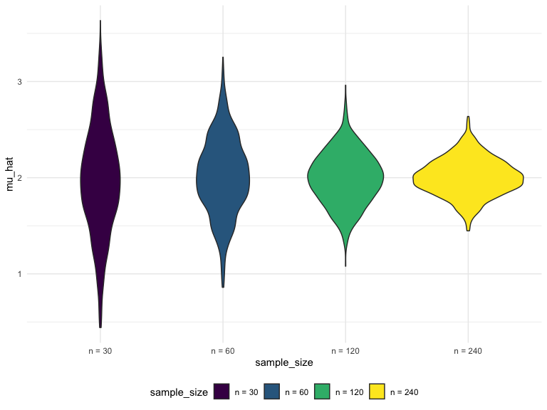

Simulations
================

## let’s simulate something

i have a function:

``` r
sim_mean_sd = function(n, mu = 2, sigma = 3) {
  
  sim_data = tibble(
    x = rnorm(n, mean = mu, sd = sigma),
  )
  
  sim_data %>% 
    summarize(
      mu_hat = mean(x),
      sigma_hat = sd(x)
    )
}
```

i can ‘simulate’ by running this line over and over.

``` r
sim_mean_sd(30)
```

    ## # A tibble: 1 x 2
    ##   mu_hat sigma_hat
    ##    <dbl>     <dbl>
    ## 1   1.96      2.46

## let’s simulate a lot.

let’s start with a for loop.

``` r
output = vector("list", 100)

for (i in 1:100) {
  output[[i]] = sim_mean_sd(30)
}

sim_results = bind_rows(output)
```

let’s use a loop function. (we don’t use map here because we don’t have
a input list in this case)

``` r
sim_results = 
  rerun(100, sim_mean_sd(n = 30)) %>% 
  bind_rows()
```

let’s look at results…

``` r
sim_results %>% 
  ggplot(aes(x = mu_hat)) + 
  geom_density()
```


``` r
sim_results %>% 
  summarize(
    avg_samp_mean = mean(mu_hat),
    sd_samp_mean = sd(mu_hat)
  )
```

    ## # A tibble: 1 x 2
    ##   avg_samp_mean sd_samp_mean
    ##           <dbl>        <dbl>
    ## 1          1.99        0.525

``` r
sim_results %>% 
  pivot_longer(
    mu_hat:sigma_hat,
    names_to = "parameter", 
    values_to = "estimate") %>% 
  group_by(parameter) %>% 
  summarize(
    emp_mean = mean(estimate),
    emp_sd = sd(estimate)) %>% 
  knitr::kable(digits = 3)
```

    ## `summarise()` ungrouping output (override with `.groups` argument)

| parameter  | emp\_mean | emp\_sd |
| :--------- | --------: | ------: |
| mu\_hat    |     1.989 |   0.525 |
| sigma\_hat |     2.938 |   0.385 |

## let’s try other sample sizes.

``` r
n_list = 
  list(
    "n_30"  = 30, 
    "n_60"  = 60, 
    "n_120" = 120, 
    "n_240" = 240)

output = vector("list", length = 4)

for (i in 1:4) {
  output[[i]] = 
    rerun(100, sim_mean_sd(n_list[[i]])) %>% 
    bind_rows
}
```

``` r
sim_results = 
  tibble(sample_size = c(30, 60, 120, 240)) %>% 
  mutate(
    output_lists = map(.x = sample_size, ~rerun(1000, sim_mean_sd(n = .x))),
    estimate_dfs = map(output_lists, bind_rows)) %>% 
  select(-output_lists) %>% 
  unnest(estimate_dfs)
```

do some data frame things

``` r
sim_results %>% 
  mutate(
    sample_size = str_c("n = ", sample_size),
    sample_size = fct_inorder(sample_size)) %>% 
  ggplot(aes(x = sample_size, y = mu_hat, fill = sample_size)) + 
  geom_violin()
```



``` r
sim_results %>%
  group_by(sample_size) %>%
  summarize(
    avg_samp_mean = mean(mu_hat),
    sd_samp_mean = sd(mu_hat))
```

    ## `summarise()` ungrouping output (override with `.groups` argument)

    ## # A tibble: 4 x 3
    ##   sample_size avg_samp_mean sd_samp_mean
    ##         <dbl>         <dbl>        <dbl>
    ## 1          30          1.97        0.547
    ## 2          60          2.01        0.397
    ## 3         120          1.99        0.269
    ## 4         240          2.01        0.192
